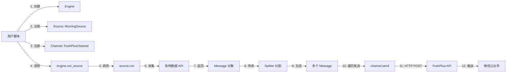

# IFTTT 架构运行流程详解

## 一、核心概念

新架构遵循 **Input → Processing → Output** 模式：

```
Source (数据源) → Message (标准消息) → Engine (引擎) → Channel (通道)
```

---

## 二、执行流程图



---

## 三、关键模块说明

### 1. **核心层 (core/)**

#### `Message` 数据类
```python
@dataclass
class Message:
    title: str              # 标题
    content: Any            # 内容（HTML/Markdown/文本）
    type: ContentType       # 类型（HTML/MARKDOWN/TEXT等）
    tags: List[str]         # 标签（用于路由）
    metadata: Dict[str, Any] # 元数据
```

**作用**: 标准化数据格式，解耦 Source 和 Channel

#### `SourceInterface` 接口
```python
class SourceInterface(ABC):
    @abstractmethod
    def run(self) -> Message:
        """生成数据并返回 Message"""
        pass
```

**作用**: 定义所有数据源必须实现的方法

#### `ChannelInterface` 接口
```python
class ChannelInterface(ABC):
    @abstractmethod
    def send(self, message: Message) -> bool:
        """发送消息"""
        pass
```

**作用**: 定义所有推送通道必须实现的方法

#### `Engine` 调度器
```python
class Engine:
    def run_source(self, source_name, channel_names):
        # 1. 获取 Source
        # 2. 调用 source.run() 获取 Message
        # 3. 通过 Splitter 分割
        # 4. 遍历 Channels 发送
```

**作用**: 协调 Source 和 Channel 的执行

#### `Splitter` 内容分割器
```python
class Splitter:
    def split(self, message: Message) -> List[Message]:
        """根据长度限制分割消息"""
```

**作用**: 处理 PushPlus 18k 字符限制

---

### 2. **数据源层 (sources/)**

#### `MorningSource` 早报数据源
```python
class MorningSource(BaseSource):
    def __init__(self, topic='me'):
        self.topic = topic  # 个性化配置
    
    def run(self) -> Message:
        # 1. 收集数据: _gather_data()
        # 2. 生成内容: _create_markdown()
        # 3. 返回 Message
        return Message(
            title='今日概要(02-03)',
            content=markdown_text,
            type=ContentType.MARKDOWN,
            tags=['morning', 'daily', 'me']
        )
```

**核心方法**:
- `_gather_data()`: 并发调用各种 API（天气/金价/汇率等）
- `_get_date_info()`: 日期、节假日信息
- `_get_cny_price()`: 人民币汇率
- `_get_gold_price()`: 金价
- `_create_markdown()`: 组装成 Markdown 格式

**复用原有函数**:
```python
from morning.main import (
    get_quota_info,    # VPN 流量
    get_index,         # 夜盘指数
    get_oil_price,     # 油价
    get_game,          # 游戏赛程
    get_hot_search,    # 热搜图片
    get_news_url,      # 新闻图片
    get_lsjt           # 历史今天图片
)
```

---

### 3. **推送通道层 (channels/)**

#### `PushPlusChannel` 真实推送
```python
class PushPlusChannel(ChannelInterface):
    def send(self, message: Message) -> bool:
        # 1. 映射 ContentType → PushPlus template
        # 2. 构建 API 请求数据
        # 3. POST 到 PushPlus
        # 4. 返回成功/失败
```

**API 调用**:
```python
url = "http://www.pushplus.plus/send"
data = {
    "token": self.token,
    "title": message.title,
    "content": message.content,
    "template": "markdown"  # html/markdown/txt
}
requests.post(url, data=json.dumps(data))
```

#### `MockChannel` 测试通道
```python
class MockChannel(ChannelInterface):
    def send(self, message: Message) -> bool:
        # 只打印，不真实发送
        print(f"[MockChannel] Title: {message.title}")
        return True
```

---

## 四、完整执行流程（以 push_morning.py 为例）

### 步骤 1: 创建引擎
```python
engine = Engine()
```

### 步骤 2: 注册数据源
```python
engine.register_source('morning', MorningSource(topic='me'))
```

### 步骤 3: 注册推送通道
```python
engine.register_channel('pushplus', PushPlusChannel())
```

### 步骤 4: 执行推送
```python
engine.run_source('morning', ['pushplus'])
```

**内部执行流程**:
```
1. Engine.run_source('morning', ['pushplus'])
   ↓
2. source = self.sources['morning']  # 获取 MorningSource
   ↓
3. message = source.run()  # 调用 MorningSource.run()
   ├─ _gather_data()  # 收集天气/金价/汇率...
   ├─ _create_markdown(context)  # 生成 Markdown
   └─ return Message(...)
   ↓
4. messages = self.splitter.split(message)  # 分割长消息
   ↓
5. for channel_name in ['pushplus']:
       channel = self.channels['pushplus']  # 获取 PushPlusChannel
       for msg in messages:
           channel.send(msg)  # 真实推送
           └─ requests.post(PushPlus API)
```

---

## 五、数据流示例

### Morning 数据收集流程

```python
context = {
    'date_info': {          # _get_date_info()
        'time': '2026-02-03 20:53:08',
        'weekday': '星期一',
        'year': 2026,
        ...
    },
    'weather': {            # get_weather()
        '双流': ['晴', '18°C'],
        '西安': ['阴', '5°C'],
        ...
    },
    'english': (            # get_daily_english()
        'Life is short...',
        '生命短暂...'
    ),
    'index': {              # get_index()
        'A50': 0.5,
        'DJIA': -0.3,
        ...
    },
    'currency': {           # _get_cny_price()
        'CNY': {...},
        'CNH': {...}
    },
    'gold': {...},          # _get_gold_price()
    'oil': DataFrame,       # get_oil_price()
    'quota': {...},         # get_quota_info()
    'games': DataFrame,     # get_game()
    'images': {             # get_hot_search/news/lsjt
        'hot_search': 'https://...',
        'news': 'https://...',
        ...
    }
}
```

### Markdown 生成流程

```python
_create_markdown(context) →
    "###### 🕔更新时间:2026-02-03 20:53:08\n"
    "###### 📅 基本信息\n"
    "· 今天 星期一, Monday, 交易日数据暂不可用<br>\n"
    "· 2026 年第 6 周,第 34 天<br>\n"
    ...
    "###### ☀️ 今日天气\n"
    "· 双流: 晴, 18°C<br>\n"
    ...
```

---

## 六、优势总结

| 维度 | 旧架构 | 新架构 |
|------|--------|--------|
| **耦合度** | 数据+推送混在一起 | 完全解耦 |
| **可测试性** | 必须真实推送 | MockChannel 测试 |
| **扩展性** | 修改 main.py | 新增 Source/Channel 类 |
| **复用性** | 逻辑不可复用 | Message 可多通道推送 |
| **维护性** | 618 行单文件 | 模块化分离 |

---

## 七、关键文件清单

```
/nfs/python/push/
├── core/                      # 核心框架
│   ├── __init__.py           # Message, SourceInterface, ChannelInterface
│   ├── engine.py             # Engine 调度器
│   ├── template.py           # TemplateEngine (Jinja2)
│   └── splitter.py           # Splitter 分割器
├── channels/                  # 推送通道
│   ├── __init__.py
│   ├── mock.py               # MockChannel
│   └── pushplus.py           # PushPlusChannel
├── sources/                   # 数据源
│   ├── base.py               # BaseSource
│   └── morning/              # Morning 模块
│       ├── __init__.py
│       ├── source.py         # MorningSource ⭐
│       ├── weather.py        # 天气模块
│       └── english.py        # 英语模块
├── push_morning.py           # 真实推送脚本 ⭐
└── test_morning.py           # Mock 测试脚本
```

**核心入口**: `push_morning.py` 32 行代码完成整个流程
